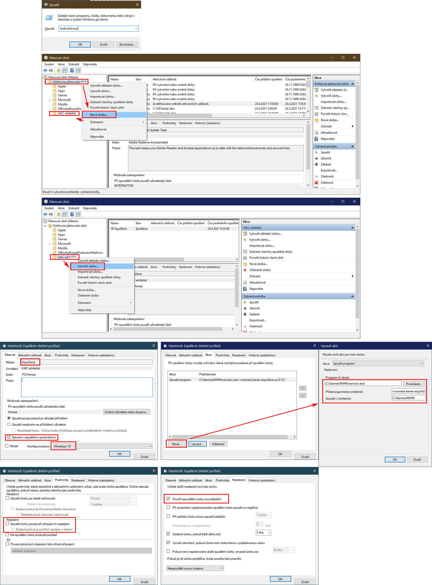

<p align="center">
  
</p>

# EQ Launcher a Logger pro NWN:EE

Launcher pro **Neverwinter Nights: Enhanced Edition**, který po spuštění připojí hru k serveru Equilibrie a po jejím ukončení zpracuje logy a screenshoty.

## Co launcher umí

- automaticky spustit NWN:EE a připojit se k serveru Equilibrie,
- zálohovat úplný i pročištěný herní log,
- převést screenshoty z TGA do JPG a původní soubory zabalit do archivu,
- volitelně zobrazovat bojový log postavy v PowerShellu,
- volitelně spouštět Discord Rich Presence,
- volitelně spouštět hru přes Plánovač úloh bez potvrzování UAC.

## Instalace

1. V NWN:EE zapněte ukládání celého chatu:

   ```text
   game log chat all
   ```

2. Obsah repozitáře nakopírujte do adresáře:

   ```text
   Dokumenty\Neverwinter Nights\
   ```

   > Nic z tohoto repozitáře nekopírujte přímo do instalačního adresáře hry.

3. Otevřete `EQ.cmd` v textovém editoru a u proměnné `var_path` nastavte cestu k adresáři instalace hry, který končí `bin\win32`.

   Například pro instalaci ze Steamu může cesta vypadat takto:

   ```bat
   SET var_path="C:\Games\Steam\steamapps\common\Neverwinter Nights\bin\win32"
   ```

4. Hru spouštějte pomocí `EQ.cmd`. Pro pohodlnější používání si můžete vytvořit jeho zástupce na ploše.

5. Okno launcheru během hraní ručně nezavírejte. Skript čeká na ukončení NWN:EE a teprve potom zpracuje logy a screenshoty.

Při prvním zpracování většího množství screenshotů může převod a archivace chvíli trvat. Okno nechte otevřené, dokud launcher neoznámí dokončení.

## Nastavení launcheru

Jednotlivé funkce se zapínají a vypínají přímo v `EQ.cmd`. Hodnota `0` znamená vypnuto, hodnota `1` zapnuto.

```bat
SET /A var_discord = 0
SET /A var_parser = 0
SET /A var_parser_kill = 0
SET /A var_log = 1
SET /A var_screenshot = 1
```

| Proměnná | Funkce |
| --- | --- |
| `var_discord` | Spustí Discord Rich Presence přes EasyRP. |
| `var_parser` | Spustí bojový parser v samostatném okně PowerShellu. |
| `var_parser_kill` | Po ukončení hry automaticky zavře PowerShell s parserem. |
| `var_log` | Zapne zálohování a čištění herního logu. |
| `var_screenshot` | Zapne převod a archivaci screenshotů. |

## Logy a screenshoty

Při zapnutém logování vznikají v adresáři `logs` dva inkrementální soubory:

- `logs\zaloha_equilibrie.log` — úplný log, tedy kopie obsahu zalogovaného NWN:EE,
- `logs\zaloha_equilibrie_cl.log` — pročištěný log zbavený většiny nepotřebných záznamů.

Při zapnutém zpracování screenshotů launcher po ukončení hry:

1. převede soubory TGA v adresáři `screenshots` do JPG,
2. zabalí původní TGA do archivu `.7z`,
3. uloží JPG i archiv do nové složky pojmenované podle data a času.

## Bojový parser

Pro zapnutí parseru nastavte v `EQ.cmd`:

```bat
SET /A var_parser = 1
```

Potom otevřete `logs\parser.ps1` a upravte jméno své postavy:

```powershell
$charname = "Alariel"
$delname = "Erna"
```

- `$charname` je jméno postavy. U víceslovného jména obvykle stačí první slovo nebo jeho jednoznačná část.
- `$delname` je zbytek víceslovného jména, který nechcete ve výpisu zobrazovat.

Pokud chcete parser po skončení hry automaticky zavřít, nastavte také `var_parser_kill` na `1`.

## Discord Rich Presence

1. V `EQ.cmd` nastavte:

   ```bat
   SET /A var_discord = 1
   ```

2. V Discordu vytvořte vlastní Rich Presence aplikaci a nahrajte její obrázky.
3. V souboru `EasyRP-windows\config.ini` nastavte `ClientID`, texty a názvy obrázků vytvořené aplikace.

Podrobnosti k EasyRP jsou v souboru [`EasyRP-windows/readme.txt`](EasyRP-windows/readme.txt). Logo Equilibrie pro Rich Presence je připravené jako `EasyRP-windows\eq_logo_512.png`.

## Volitelné spuštění bez potvrzování UAC

Pokud Windows při každém spuštění NWN:EE vyžaduje potvrzení UAC, lze hru spouštět přes Plánovač úloh.

1. Stiskněte <kbd>Win</kbd> + <kbd>R</kbd>, zadejte `taskschd.msc` a potvrďte.
2. V Knihovně plánovače úloh vytvořte složku `UAC Whitelist`.
3. Ve složce vytvořte úlohu pojmenovanou `Equilibrie`.
4. Zaškrtněte **Spustit s nejvyššími oprávněními**.
5. Jako akci nastavte spuštění `nwmain.exe` z adresáře NWN:EE `bin\win32`.
6. Do argumentů přidejte:

   ```text
   +connect server.equilibrie.cz:5121
   ```

7. Jako pracovní adresář nastavte stejný adresář `bin\win32` a povolte spuštění úlohy na požádání.
8. V `EQ.cmd` nahraďte přímé spuštění hry příkazem Plánovače úloh:

   ```bat
   :: pusteni nwn
   cd %var_path%
   C:\Windows\System32\schtasks.exe /RUN /TN "UAC Whitelist\Equilibrie"
   :: start nwmain.exe +connect server.equilibrie.cz:5121
   ```

Cesty na obrázku jsou pouze příklad. Pro NWN:EE vždy vyberte vlastní `nwmain.exe` v adresáři končícím `bin\win32`.

